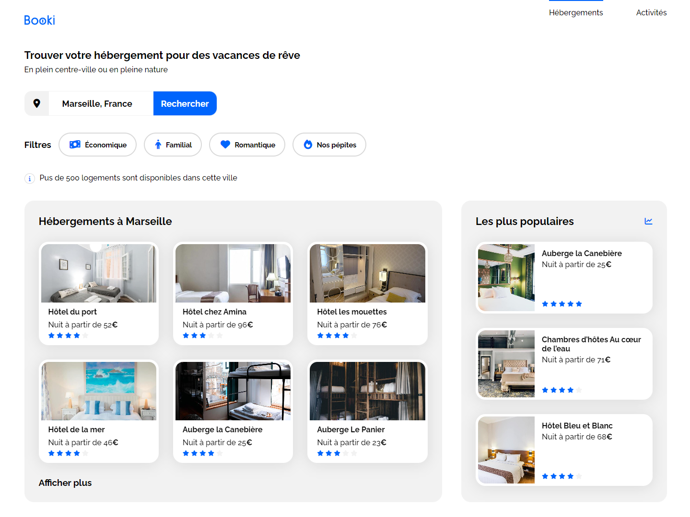

# Booki

Le projet Booki vise à développer une interface conviviale permettant aux utilisateurs de rechercher et de réserver facilement des hébergements et des activités dans leur ville de prédilection.

## Description

Projet réalisé dans le cadre de ma formation OpenClassrooms, j'ai été chargé d'intégrer l'interface du site en utilisant uniquement HTML et CSS.
